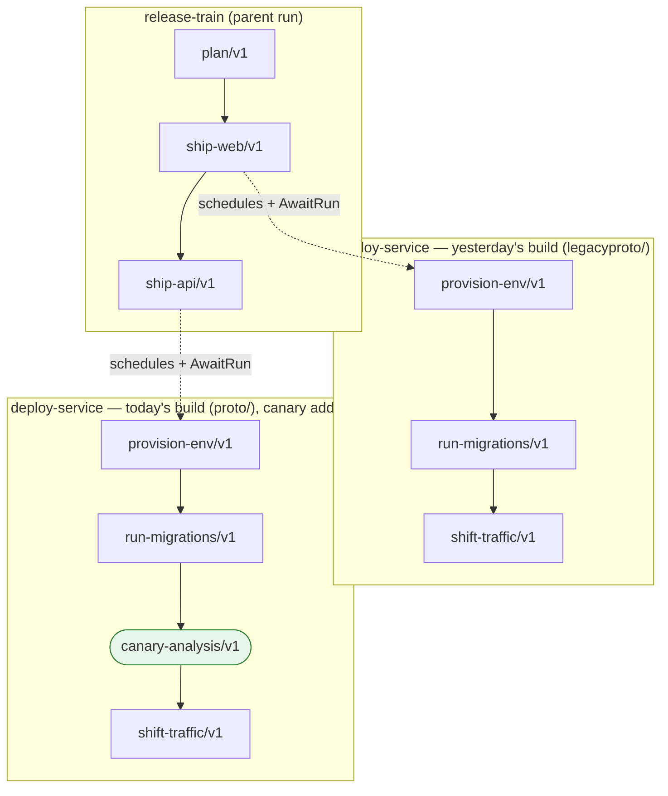
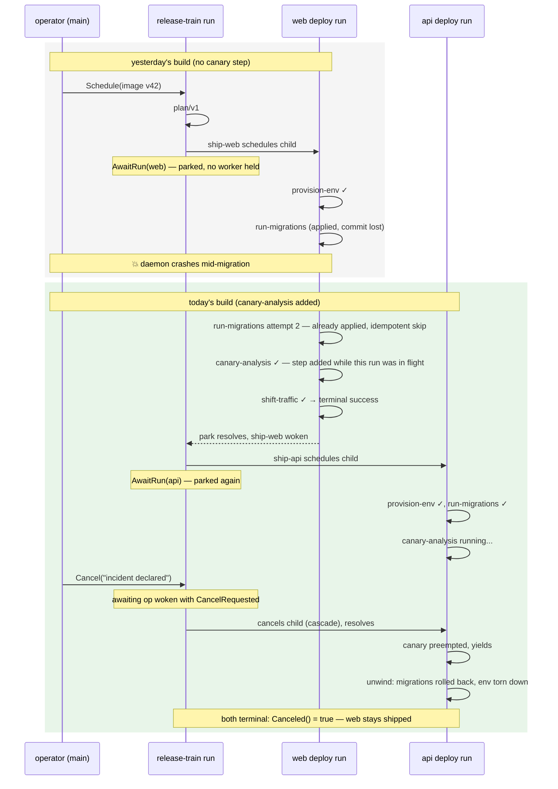

# release-train

The flagship durable demo: one release run that lives through
everything the library exists for — a daemon crash, an interrupted
attempt re-executed idempotently, a pipeline definition that evolves
while the run is in flight, parent runs awaiting children, and a
cascading cancellation that rolls back exactly what it should.

```sh
go run ./examples/release-train
```

## The pipelines

Two pipelines, composed: a `release-train` parent ships each service by
scheduling a `deploy-service` child run and parking on it with
`AwaitRun` (no worker or token is held while parked). The deploy
pipeline exists in two builds — same pipeline id, different topology —
because that is the point:



`provision-env` and `run-migrations` declare `unwind: true` — their
rollbacks (environment teardown, migration rollback) run in reverse
order when a deploy fails permanently or is canceled.

The two builds live in separate buf modules (`legacyproto/` and
`proto/`) with the *same* pipeline id, which is also the honest
framing: yesterday's and today's builds never coexist in a real binary.
This example carries both only to simulate a daemon restart onto a new
deployment.

## The flow

One process, two engine generations, one bbolt store:



## What to look for in the output

| chapter | line |
|---|---|
| durability | `---- daemon crashes; restarting with today's build ----` — only the store survives |
| at-least-once | `[web] migrations already applied — idempotent re-execution` |
| evolution | `[web] canary analysis: score 98 — a step added while this run was in flight` |
| composition | `[train] web deploy scheduled; parking until it lands` |
| cancellation | `[train] release frozen — canceling api deploy` → `[api] migrations rolled back (unwind)` |

## The cast

| file | role |
|---|---|
| `main.go` | the story: schedule, crash, restart, freeze, verdict |
| `world.go` | the fake platform backend — what "survives" the crash |
| `deploy.go` | today's `deploy-service` handlers (`releasepb`) |
| `legacy.go` | yesterday's handlers (`legacypb`), including the crash-mid-migration one |
| `train.go` | the parent orchestration: schedule child, `AwaitRun`, cascade cancel |
| `builds.go` | the two daemon generations wired to their pipelines |
| `main_test.go` | asserts the durable facts, not print interleaving |

For the concepts behind each chapter, see the
[guided tour](../../docs/tour.md); for the full rules,
[the specification](../../spec/README.md).
